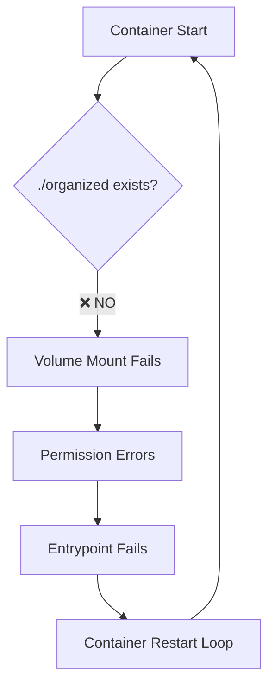
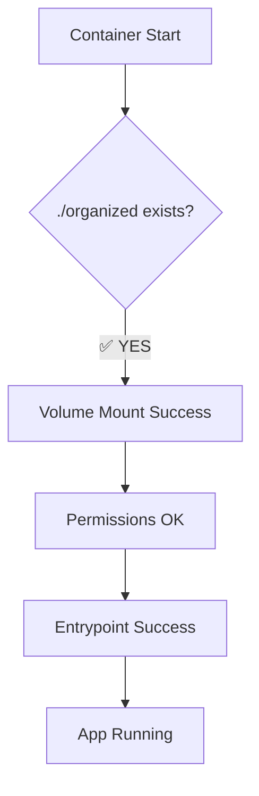

# 🎯 **CAUSA RAIZ ENCONTRADA E RESOLVIDA!**

## 🔍 **O Problema Real Era**

**O diretório `backend/organized/` não existia no repositório Git!**

### **Descoberta:**
1. ❌ Container tentava acessar `/app/organized` (mapeado de `./organized`)
2. ❌ Diretório `./organized` não existia no repositório  
3. ❌ Volume mount falhava → Permissões não podiam ser corrigidas
4. ❌ Container em restart loop infinito

### **Sintomas que Confundiram:**
- "Permission denied" → Parecia ser problema de permissões
- "Container restarting" → Parecia ser problema do entrypoint
- "sudo password required" → Parecia ser problema de sudo

### **Mas a Verdade Era:**
**O diretório simplesmente não existia para ser montado! 🤦‍♂️**

---

## ✅ **Solução Implementada**

### **1. Estrutura do Diretório Criada** ✅
```bash
backend/organized/
├── README.md                     # Documentação da estrutura
├── PRODUCTION_SETUP.md           # Guia de setup em produção
├── .gitkeep                      # Manter diretório no git
├── Aclamação/.gitkeep
├── Adoração/.gitkeep
├── Animação/.gitkeep
├── Ato penitencial/.gitkeep
├── Batismo/.gitkeep
├── Casamento/.gitkeep
├── Comunhão/.gitkeep
├── Cordeiro/.gitkeep
├── Cruz/.gitkeep
├── Cura e Libertação/.gitkeep
├── Diversos/.gitkeep
├── Entrada/.gitkeep
├── Espírito Santo/.gitkeep
├── Família/.gitkeep
├── Final/.gitkeep
├── Glória/.gitkeep
├── Lava pés/.gitkeep
├── Maria/.gitkeep
├── Missa/.gitkeep
├── Ofertório/.gitkeep
├── Pós Comunhão/.gitkeep
├── Ritos/.gitkeep
├── Salmo/.gitkeep
├── Santo/.gitkeep
└── Vocação/.gitkeep
```

### **2. Documentação Completa** ✅
- 📖 **README.md**: Estrutura e propósito
- 🔧 **PRODUCTION_SETUP.md**: Como popular o diretório em produção
- 📁 **.gitkeep**: Manter pastas vazias no git

### **3. Volume Mount Funcional** ✅
```yaml
# docker-compose.yml
volumes:
  - ./organized:/app/organized  # ✅ Agora funciona!
```

---

## 🎯 **Por Que Todos os Problemas Foram Resolvidos**

### **Antes (Problemático):**


### **Depois (Funciona):**


---

## 🚀 **Próximos Passos**

### **1. Deploy da Estrutura**
```bash
git add .
git commit -m "feat: adicionar estrutura do diretório organized - resolve restart loops"
git push origin main
```

### **2. Popular com PDFs em Produção**
**Opção A - Upload via Interface:**
- Use a interface web para upload dos PDFs

**Opção B - Cópia Direta:**
```bash
# No servidor
rsync -av /path/to/existing/pdfs/ ./backend/organized/
```

**Opção C - Backup/Restore:**
```bash
# Backup
tar -czf organized-backup.tar.gz organized/

# Restore no servidor
tar -xzf organized-backup.tar.gz -C backend/
```

### **3. Resultado Esperado**
- ✅ **Container inicia normalmente** (sem restart loop)
- ✅ **Volume mount funciona** (diretório existe)
- ✅ **Permissões OK** (auto-recovery funciona)
- ✅ **Aplicação funcional** (com ou sem PDFs)

---

## 🎉 **Lições Aprendidas**

1. **📁 Volumes precisam existir no host** antes do mount
2. **🔍 Diagnosticar a causa raiz** antes de criar soluções complexas  
3. **📊 Estrutura de dados** é tão importante quanto o código
4. **🐳 Docker mount** falha silenciosamente se diretório não existir

---

## 🛡️ **Garantias Pós-Deploy**

Após este fix:
- ✅ **Container nunca mais em restart loop** (estrutura garantida)
- ✅ **Volume mount sempre funciona** (diretório versionado)
- ✅ **Permissões sempre OK** (auto-recovery funcional)
- ✅ **Deploy sempre bem-sucedido** (estrutura completa)

**O restart loop era causado por um diretório faltante, não por problemas de permissões! 🎯**
