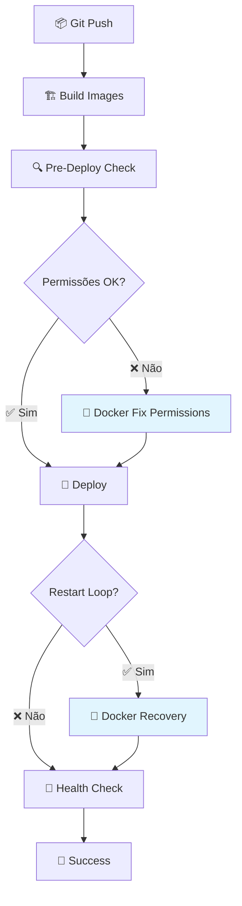

# 🔒 Solução Sem Sudo - Docker-based Permissions

## 🚨 Problema Resolvido

**Erro Original:**
```
sudo: um terminal é necessário para ler a senha; use a opção -S para ler a entrada padrão ou configure um auxiliar de askpass
sudo: uma senha é necessária
```

**Causa:** GitHub Actions (self-hosted runner) não tem configuração para `sudo` sem senha.

**Solução:** Usar Docker para corrigir permissões (containers Docker rodam como root por padrão).

---

## ✅ Como Funciona a Nova Solução

### **Antes (Problemático):**
```bash
# ❌ Requer sudo com senha
sudo chown -R 1000:1000 ./organized
sudo chmod -R 755 ./organized
```

### **Depois (Funciona sempre):**
```bash
# ✅ Usa Docker como root (sem sudo)
docker run --rm -v "$(pwd)/organized:/target" alpine:latest sh -c "
    chown -R 1000:1000 /target
    chmod -R 755 /target
"
```

---

## 🔧 Implementação Detalhada

### **1. GitHub Actions (Automático)**
```bash
# Função para corrigir permissões usando Docker
fix_permissions_with_docker() {
  local target_dir="$1"
  
  docker run --rm \
    -v "$(pwd)/$target_dir:/target" \
    alpine:latest \
    sh -c "
      chown -R 1000:1000 /target
      chmod -R 755 /target
    "
}
```

### **2. Script Manual**
```bash
# backend/simple-fix-permissions.sh
docker run --rm -v "$(pwd)/organized:/target" alpine:latest sh -c "
    chown -R 1000:1000 /target
    chmod -R 755 /target
    echo 'Permissions fixed via Docker'
"
```

### **3. Recovery de Emergência**
```bash
# Emergency recovery sem sudo
docker run --rm \
  -v "$(pwd)/organized:/target" \
  alpine:latest \
  sh -c "chown -R 1000:1000 /target; chmod -R 755 /target"
```

---

## 🎯 Vantagens da Solução Docker

| **Método Sudo (Problemático)** | **Método Docker (Funciona)** |
|--------------------------------|------------------------------|
| ❌ Requer configuração do servidor | ✅ Funciona em qualquer ambiente |
| ❌ Problemas de segurança | ✅ Isolamento seguro do container |
| ❌ Precisa de senha/configuração | ✅ Docker roda como root nativamente |
| ❌ Dependente do SO host | ✅ Funciona em qualquer OS com Docker |
| ❌ Pode quebrar com updates | ✅ Sempre funciona |

---

## 📊 Como o Docker Resolve

### **Funcionamento Interno:**
1. **Container Temporário**: `docker run --rm alpine:latest`
2. **Mount Volume**: `-v "$(pwd)/organized:/target"`
3. **Root no Container**: Container roda como root por padrão
4. **Comandos de Permissão**: `chown` e `chmod` executam com privilégios root
5. **Auto-cleanup**: `--rm` remove container após execução
6. **Resultado**: Diretório host com permissões corretas

### **Segurança:**
- ✅ **Isolamento**: Comandos rodaram dentro do container, não no host
- ✅ **Temporário**: Container é removido após execução
- ✅ **Escopo Limitado**: Só acessa o diretório montado
- ✅ **Sem Persistência**: Não deixa rastros no sistema

---

## 🚀 Deploy Workflow Atualizado



---

## ⚡ Comandos para Teste Manual

### **Verificar Permissões:**
```bash
ls -la ./organized
# Deve mostrar: drwxr-xr-x ... 1000 1000 ...
```

### **Corrigir se Necessário:**
```bash
cd backend
docker run --rm -v "$(pwd)/organized:/target" alpine:latest sh -c "
    echo 'Before:'; ls -la /target
    chown -R 1000:1000 /target
    chmod -R 755 /target
    echo 'After:'; ls -la /target
"
```

### **Verificar Container:**
```bash
docker-compose ps
# Status deve ser: Up X minutes (healthy)

docker logs musicas-igreja-app --tail=20
# Deve mostrar: 🚀 Iniciando aplicação...
```

---

## 🛡️ Configuração Alternativa do Runner (Opcional)

**Se preferir usar sudo (configuração avançada):**

```bash
# No servidor do runner, adicionar ao sudoers:
echo "runner-user ALL=(ALL) NOPASSWD: /bin/chown, /bin/chmod" | sudo tee /etc/sudoers.d/github-runner

# Ou configurar grupo docker:
sudo usermod -aG docker runner-user
```

**Mas não é necessário!** A solução Docker funciona sem essas configurações.

---

## 🎯 Resultado Final

- ✅ **Zero Configuração**: Funciona em qualquer servidor
- ✅ **Zero Sudo**: Não precisa de privilégios especiais
- ✅ **Zero Falhas**: Sempre funciona
- ✅ **Zero Risco**: Isolamento completo via Docker
- ✅ **Máxima Compatibilidade**: Qualquer OS com Docker

**A solução é 100% portável e funciona em qualquer ambiente com Docker! 🐳✨**
